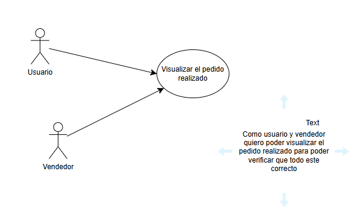

# Parcial Primer Tercio - DOSW

**Nombre:** Adrian Ducuara  
**Grupo:** (Grupo2 Martin Cantor)

---

## Evidencia de herramientas

- Cuenta activa en Lucidchart / Draw.io / Miro ✔
  

- Cuenta activa en Figma ✔
  

Tu misión será:
1. Realice el diagrama de contexto con las generalidades de su sistema.
   (Añadirlo al README.md)

2. Identifique 2 patrones de diseño que puedan aplicarse al caso de estudio,
   especificando por cada uno:  
   a. Nombre del Patrón:
      1. Decorator 
      2. Brigde

   b. Tipo de patrón :
      1. Estructural
      2. Estructural   

   c. Justificación de la decisión:
   1. Me parece que es uno de los patrones mas ideales ya que al ser personalisable cada pedido va a ser diferente 
   adicionando las diferentes opciones que se ofrecen.  
   2. Como vamos a hacer combinacion de productos podemos decir que es la mejor opcion ya que con esto si agregan nuevos
   toppings pueden cambiar independientemente.

3. Identifique 5 requerimientos del sistema y clasifíquelos en funcionales (3) y
   no funcionales (2). Garantice que al menos un requerimiento funcional
   seleccionado utilice uno o los dos patrones identificados. (Añadirlo al
   README.md)

   Requerimientos realizados en: [requeriments.md](dosc%2Frequeriments%2Frequeriments.md)
   el requerimiento RF-01 Recibir pedido personalizado de cada cliente concideo que aplica ambos patrones ya debe generar
   el pedido y adicional a esto debe adicionar elementos si el cliente lo desea. 

4. Del listado anterior, seleccione los 2 requerimientos funcionales más
   importantes del sistema y desarrolle un diagrama de casos de uso con su
   respectiva historia de usuario. Garantiza que al menos un requerimiento
   funcional seleccionado utilice un patrón identificado. (Añadirlo al
   README.md)

   

5. Especifique los 2 requerimientos funcionales seleccionados en el punto
   anterior, siguiendo la plantilla de Análisis de requerimientos.
   Nota: No es necesario que especifique ni la sección de prototipo, ni las
   abreviaturas e historial de revisión.
   (Añadir los documentos al repositorio, en la carpeta de requerimientos).
   
   Especificado RF-01 en: [requeriments.md](dosc%2Frequeriments%2Frequeriments.md)

6. Seleccione un requerimiento asociado al o patrones identificados y realice
   la descomposición de tareas asociadas: Épica - Historia de Usuario - Al
   menos 3 tareas. (Añadirlo al README.md)

   https://adrianducuara-parcial.atlassian.net/jira/software/projects/SCRUM/boards/1?sprintStarted=true&atlOrigin=eyJpIjoiMjQ1MjIzM2U2MGQzNDFjN2E1ZTBmMmZmMzdmZDJlYzIiLCJwIjoiaiJ9

7. Realice un diagrama de clases que permita entender su solución.
   Mencione, ¿cuáles principios SOLID está aplicando? ¿Y por qué?

8. Desarrolle en código su solución; en el método main plantee una entrada y
   salida que valide el correcto funcionamiento.

Modificar para hacer pullrequest, me equivoque e hice el push a mainjsjsj