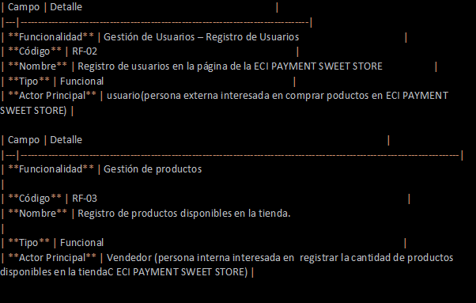

# Parcial: Analisis de requeriminetos

- 5 requerimientos del sistema clasificar en 3 funcionales y 2 no funcionales
- Garantizar que almenos un requerimiento funcional utilice uno o los dos patrones elegidos(bridge y decorato)

| Campo | Detalle                                                |
|---|--------------------------------------------------------|
| **Funcionalidad** | Recibir pedido                                         |
| **Código** | RF-01                                                  |
| **Nombre** | Recibir pedido personalizado de cada cliente           |
| **Tipo** | Funcional                                              |
| **Actor Principal** | Usuario(Persona externa interesada en hacer el pedido) |

**Descripción:**
El sistema debe permitir que el usuario pueda registrar el pedido con los productos, las 
personalizaciones y los extras confirmando el pedido realizado.

**Cómo se ejecutará:**
El usuario digitara el pedido adicionando productos sobre la carta de nuestra tienda de esta manera se 
validara el pedido y confirmara.

### Precondiciones

1. El usuario y el cajero debe tener acceso a la carta.
2. El cajero no debe tener otro pedido en curso.
3. El cajero debe tener conocimiento de los precios.

### Datos de Entrada

| Campo                     | Descripción                                            | Tipo | Reglas / Validación                                                          | Obligatorio |
|---------------------------|--------------------------------------------------------|---|------------------------------------------------------------------------------|:---:|
| Nombres completos         | Primer y segundo nombre del aspirante                  | Texto | Solo letras y espacios. Mín 3 – Máx 100 caracteres.                          | ✅ |
| Tipo de documento         | Tipo de identificación (CC, TI, etc.)                  | Lista | Selección de opciones predefinidas.                                          | ✅ |
| Número de documento       | Número de identificación del aspirante                 | Numérico | Solo dígitos. Mín 6 – Máx 15 caracteres. No puede existir en BD.             | ✅ |
| Correo electrónico        | Email personal del aspirante                           | Email | Formato válido (usuario@dominio.ext). No puede estar registrado previamente. | ✅ |
| Confirmación de correo    | Repetir el correo para validación                      | Email | Debe coincidir con el campo Correo electrónico.                              | ✅ |
| Contraseña                | Contraseña de acceso                                   | Contraseña | Mín 8 caracteres. Al menos 1 mayúscula, 1 número y 1 carácter especial.      | ✅ |
| Confirmación contraseña   | Repetir la contraseña para validación                  | Contraseña | Debe coincidir con la contraseña ingresada.                                  | ✅ |
| Número de teléfono        | Celular o teléfono de contacto                         | Numérico | 10 dígitos. Formato colombiano.                                              | ✅ |
| Ciudad de residencia      | Ciudad donde reside actualmente                        | Texto | Solo letras y espacios.                                                      | ✅ |
| Productos de interes      | Productos que quiere consumir                          | Lista | Debe seleccionarse de prodcutos disponibles.                                 | ✅ |
| Aceptación de términos    | Acepta Términos y Condiciones y Política de Privacidad | Checkbox | Debe estar marcado para continuar.                                           | ✅ |

### Datos de Salida

| Salida | Descripción                                        | Tipo | Reglas                                                            |
|---|----------------------------------------------------|---|-------------------------------------------------------------------|
| Mensaje de éxito | Confirma el registro exitoso del pedido            | Texto | Se muestra en pantalla inmediatamente.                            |
| Correo de verificación | Email con facturacion del pedido                   | Email | Generado automaticamente.                                         |
| ID de registro | Identificador único generado del numero de factura | Numérico | Generado automáticamente. Único en BD.                            |

### Flujo Básico

| Paso | Actor | Descripción                                                                                                       | Excepción                               |
|:---:|---|-------------------------------------------------------------------------------------------------------------------|-----------------------------------------|
| 1 | Aspirante | Ingresa a `www.cafeteriaeci.edu.co` y navega a la sección *"Pedidos"*.                                            | —                                       |
| 2 | Aspirante | Hace clic en el botón *"Regístrar pedido"*.                                                                       | —                                       |
| 3 | Sistema | Muestra todos los prodcutos disponibles.                                                                          | —                                       |
| 4 | Aspirante | Selecciona los prodcutos que quiere consumir.                                                                     | —                                       |
| 5 | Aspirante | Acepta los términos y condiciones marcando la casilla de verificación.                                            | —                                       |
| 6 | Aspirante | Hace clic en el botón *"Registrar pedido"*.                                                                       | —                                       |
| 7 | Sistema | Valida que halla agregado productos con un valor total mayor a 10.000$.                                           | → FA-01 si hay errores de validación.   |
| 8 | Sistema | Verifica que el correo electrónico.                                                                               | → FA-02 si el correo es invalido.       |
| 9 | Sistema | Crea el registro del pedido en la base de datos con estado *"Pendiente"*.                                         | —                                       |
| 10 | Sistema | Envía correo electrónico de verificación al email registrado.                                                     | → FA-03 si el correo no puede enviarse. |
| 11 | Sistema | Muestra pantalla de confirmación indicando que el registro fue exitoso y que debe verificar factura en su correo. | —                                       |

### Flujo Alterno (Manejo de Errores)

| Código | Actor | Descripción del Error                                             | Acción del Sistema                                                                               |
|:---:|---|-------------------------------------------------------------------|--------------------------------------------------------------------------------------------------|
| FA-01 | Sistema | No solicito los productos que sumen la cantidad total permitida.  | Muestra mensaje: *"Valor necesario no alcanzado: 10.000"*                                        |
| FA-02 | Sistema | El correo electrónico ingresado no es valido.                     | Muestra mensaje: *"Este correo es invalido. "*                                                   |
| FA-03 | Sistema | Falla en el envío del correo de factura.                          | Registra el pedido con estado *"Pendiente"* y muestra opción para reenviar el correo.            |

| No. | Regla                                                                                                                                         |
|:---:|-----------------------------------------------------------------------------------------------------------------------------------------------|
|  1  | El sistema de registro **solo estará activo** durante las horas establecidas por la ECI PAYMENT SWEET STORE                                   |
|  2  | Cada usuario solo puede tener **un registro por número de documento**. No se permiten duplicados.                                             |
|  3  | Cada aspirante solo puede registrar **un único correo electrónico**. El correo actúa como identificador único de usuario.                     |
|  4  | La contraseña debe cumplir la **política de seguridad**: mínimo 8 caracteres, al menos una letra mayúscula, un dígito y un carácter especial. |
|  5  | El productos seleccionado debe corresponder a uno de los **productos disponibles** ofrecidos por la ECI PAYMENT SWEET STORE en su horario.    |
|  6  | El usuario debe **aceptar explícitamente** los Términos y Condiciones y la Política de Privacidad para completar el registro.                 |

### Notas y Comentarios

- Se recomienda implementar **CAPTCHA** para prevenir registros automáticos masivos.
- Considerar integración con el **Sistema de Información Académica (SIA)** de la ECI PAYMENT SWEET STORE para evitar duplicados al momento de regitrar un pedido.
- El registro debe ser **responsivo** y funcionar correctamente en dispositivos móviles.
- Aplicar **Heurística de Nielsen #5** (Prevención de errores): validar campos en tiempo real (*on-blur*) antes del envío.

### Abreviaturas y Glosario

| Abreviatura | Significado                                                                 |
|-------------|-----------------------------------------------------------------------------|
| RF          | Requerimiento Funcional                                                     |
| ECI         | Escuela Colombiana de Ingeniería Julio Garavito                             |
| BD          | Base de Datos                                                               |
| CC          | Cédula de Ciudadanía                                                        |
| TI          | Tarjeta de Identidad                                                        |
| T&C         | Términos y Condiciones                                                      |
| CAPTCHA     | Completely Automated Public Turing test to tell Computers and Humans Apart  |
| Usuario     | Persona externa interesada en registrat un pedido a ECI PAYMENT SWEET STORE |

